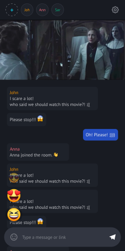

  

# PlaySho: Virtual Cinema for Shared Movie Nights

Turn off those movie nights into immersive cinematic experiences with PlaySho! 🎬 You can watch the same video with your friends from anywhere. Create a virtual cinema, share a streaming link and enjoy synchronized playback to have unforgettable experience of watching a movie.

  
  
  
  

 

## 📱 Server Side
For the Server Side of PlaySho, please visit the [PlaySho Nestjs repository](https://github.com/binaryb3ast/playsho-nest).

## 🚀 Key Features:

### 🎥 Virtual Cinema:

Set up your own private cinema room and have a shared movie night with friends.

### 🍿 Single Video Playback:

For that cinema-like feel, you can stream one video synchronously.

### 🔗 Stream Link Sharing:

Create a special stream link and invite your friends to join in your virtual theatre.

### 💬 Real-Time Interaction:

Chatting and sharing reactions among friends gives an opportunity to watch movies socially.

### 📱 Cross-Platform Accessibility:

Use PlaySho on different gadgets, be it smartphone, tablet or desktop computer to have an adjustable and joyful movie night.

### 🌐 Stay Connected:

Have common movie minutes with friends and family who are in different geographical locations.

## 🛠️ How It Works:

1. **Create Cinema Room:**
   - Set up a virtual cinema room that can be altered to suit the right mood for a perfect movie night.

2. **Choose Your Movie:**
   - Choose one video that will be enjoyed by all people together.

3. **Generate Stream Link:**
   - Share a unique streaming link with your buddies.

4. **Watch Together:**
   - Experience the magic of synchronized playback as you watch a single video together in real-time.

## 🌟 Why PlaySho:

- **Virtual Movie Nights:**
  - Make shared film nights feel like you are actually at the theatre or cinema hall

- **Synchronized Playback:**
  - Have perfect timing and synchronization that is characteristic of watching movies from cinemas

- **No Limits:**
  - Friends might be watching from anywhere making distances irrelevant

## 🎉 Turn your virtual cinema dreams into reality with PlaySho. Download now and start hosting unforgettable shared movie nights! 🍿✨
